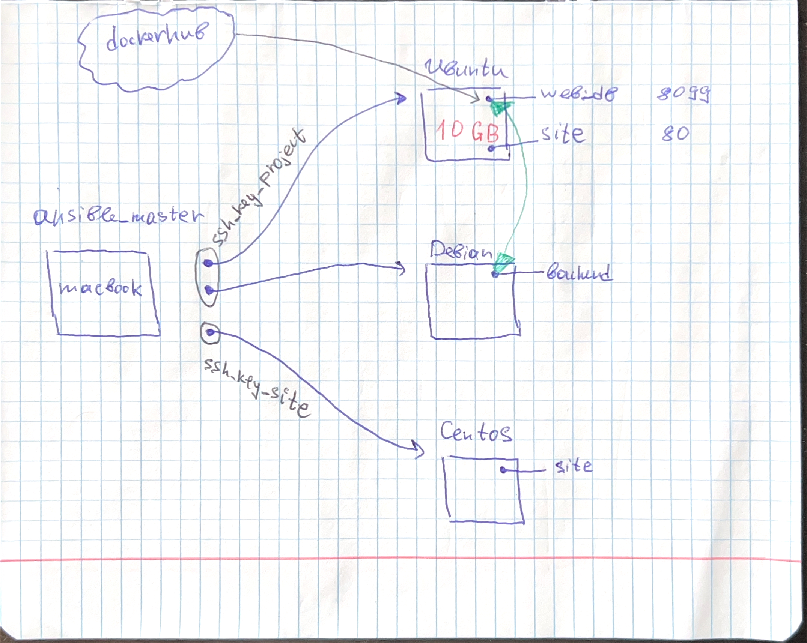

# Ansible-example
example of ansible repo

To try this ansible-playbook, you should just put required ip-addresses in hosts.txt and the run playbook.

to run playbook:
 - ansible-playbook <path_to_playbook>
